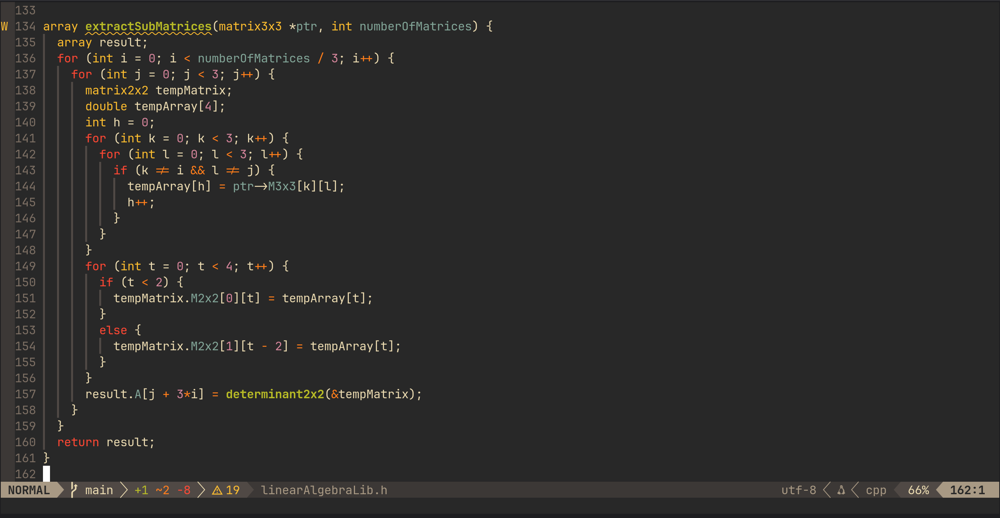

# linearAlgebraLib
A small and simple linear algebra headerfile which implements class 12 CBSE linear algebra operations in C
## Code Preview

## Supported Operations
- Adjoint
- Inverse
- Determinant
- Multiplication
- Dot Product
- Cross Product
- Addition and Subtraction (WIP)
